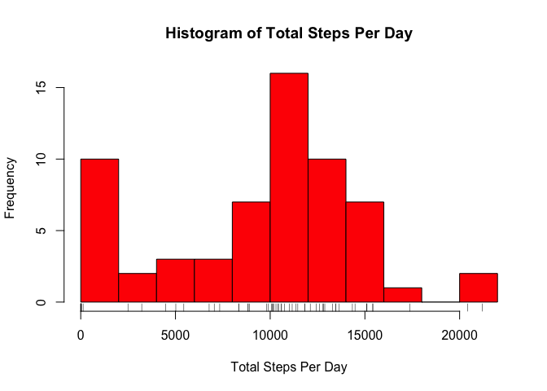
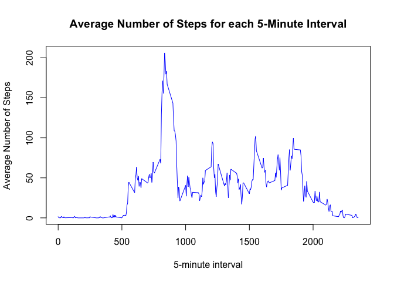

In this project, we will analyze data from a personal activity monitoring device. The data consists of the number of steps taken by an anonymous indvidiaul in 5 minute intervals each day for two months (October and November of 2012). 

## Loading and Preprocessing the Data

### Loading 
First, we will load the data set. 

```r
activity <- read.csv('activity.csv')
```

### Preprocessing
First, we take a look at the data to get an idea of how it should be preprocessed. 

```r
str(activity)
```

```
## 'data.frame':	17568 obs. of  3 variables:
##  $ steps   : int  NA NA NA NA NA NA NA NA NA NA ...
##  $ date    : Factor w/ 61 levels "2012-10-01","2012-10-02",..: 1 1 1 1 1 1 1 1 1 1 ...
##  $ interval: int  0 5 10 15 20 25 30 35 40 45 ...
```
We note that the `steps` variable has several missing values and that the `date` variable is saved as a factor variable instead of a datetime variable. 
First, we need to determine how many of the entries in `steps` are missing. We do this by calculating a percentage

```r
missingvals <- sum(is.na(activity$steps))
missingvals/length(activity$steps)*100
```

```
## [1] 13.11475
```
We find that about 13% of the step values are missing. This is a signifcant, but somewhat small percentage, so we will ignore it for now. 

To make future calculations easier, the only preprocessing we will do for now is to convert `date` into datetime format.


```r
library(lubridate)
```

```
## 
## Attaching package: 'lubridate'
```

```
## The following objects are masked from 'package:base':
## 
##     date, intersect, setdiff, union
```

```r
activity$date <- ymd(activity$date)
```

## Data Analysis

Now that our data has been loaded and processed, we can perform some basic data anlaysis answering the questions posed at the beginning of each section below. 

### What is the Mean Total Number of Steps Taken Per Day? 

Before we can answer the stated question, we must first calculate the total number of steps taken each day. 


```r
library(dplyr)
```

```
## 
## Attaching package: 'dplyr'
```

```
## The following objects are masked from 'package:lubridate':
## 
##     intersect, setdiff, union
```

```
## The following objects are masked from 'package:stats':
## 
##     filter, lag
```

```
## The following objects are masked from 'package:base':
## 
##     intersect, setdiff, setequal, union
```

```r
total_steps <- activity %>% group_by(date) %>% summarise(steps = sum(steps, na.rm = TRUE))
```

Now, we will represent this data as a histogram to get a visual idea of how the total number of steps each day is distributed and where the mean number of steps might lie.


```r
hist(total_steps$steps, col = "red", breaks = 15, xlab = 'Total Steps Per Day', main = "Histogram of Total Steps Per Day")
rug(total_steps$steps) #shows all the data points underneath
```

<!-- -->

We see that there is a large spike around 0 steps per day and another large spike around 10,000 steps per day. This is the default daily goal for many acitivity tracking devices, so it makes sense that this would be a common occurence. Beacuse of the peak around 0, we expect the mean number of total daily steps to be less than the median. Otherwise, we see the data is fairly normally distributed. 

Finally, we calculate the mean and the median.


```r
mean_steps <- mean(total_steps$steps)
median_steps <- median(total_steps$steps)
```

We find that the **mean daily number of steps is 9354.2295082** and the **median is 10395**. 

### What is the Average Daily Activity Pattern? 

To answer this question, we will create a time series plot of the 5-minute intervals (on the x-axis) and the average number of steps taken, averaged across all days (y-axis). 


First, we must calculate the average across all days for each five-minute interval. Note that there are 288 five-minute intervals in each day, and 61 days in our dataset. We use this information to calculate the averages for each five-minute interval.


```r
averages <- activity %>% group_by(interval) %>% summarise(steps = mean(steps, na.rm = TRUE))
```

Now that we have the averages, we can plot them:

```r
plot(averages$interval, averages$steps, type = "l",col='blue', xlab ='5-minute interval', ylab = 'Average Number of Steps', main = 'Average Number of Steps for each 5-Minute Interval') 
```

<!-- -->

Finally, we want to find the 5-minute interval that, on average, contains the maximum number of steps. By looking at the plot, this appears to be around the 5-minute interval that starts at the 900th minute. We calculate the exact interval by using the `which.max` function.


```r
#Calculate the location of the maximum and the maximum
max_loc <- which.max(averages$steps)
maximum <- averages$steps[max_loc]

#Find the time at which the maximum occured
max_hour <- floor(averages$interval[max_loc]/60)
max_min <- (averages$interval[max_loc]%%60)
```

So we find that **the 104th interval is the one with the highest average number of steps** (i.e. the variable `interval` is equal to 835), specifically with 206.1698113 steps on average during that interval. We find that this is the interval that starts at 13:55. 

### Imputing Missing Values

Recall that we previously computed the number of missing values in the dataset, which we found to be 2304 time intervals without information about the number of steps taken. 

We will now impute these values with the mean for that five-minute interval taken over all days, as calculated in the previous section and create a new dataset called `new_activity`.


```r
new_activity <- activity
for(i in 1:length(new_activity$steps)){
    if(is.na(new_activity$steps[i])){
        new_activity$steps[i] <- averages$steps[averages$interval==new_activity$interval[i]]
    }
}
```

Now that all the missing values are replaced with imputed values, we can get a histogram of the total number of steps each day, as before. This will also allow us to determine if our imputation scheme was reasonable by comparing it to the shape of the original histogram. 


```r
total_steps2 <- new_activity %>% group_by(date) %>% summarise(steps = sum(steps))
hist(total_steps2$steps, col = "red", breaks = 15, xlab = 'Total Steps Per Day', main = "Total Steps Per Day With Imputed Data")
rug(total_steps2$steps) #shows all the data points underneath
```

<!-- -->

As before, we see the same spike in activity around 10,000 steps per day but no spike around 0. This gives us insight that there were several days without data and so their totals were recorded as 0. We see that the histogram with the imputed values still has the shape of normally distributed data and so we conclude that our imputation scheme was reasonable, as, overall, the shape of the data did not change other than the anomalous spike caused by the missing data.  

### Are There Differences in Activity Patterns Between Weekdays and Weekends? 

To answer this question, we must first differentiate the data between weekends and weekdays; we will create a new factor variable do this. 


```r
new_activity$dayType <- factor(weekdays(activity$date),levels = c("Monday", "Tuesday", "Wednesday", "Thursday", "Friday", "Saturday", "Sunday"), labels = c("weekday", "weekday", "weekday","weekday","weekday","weekend", "weekend"))    
```

Now, we will find the average number of steps taken over each 5-minute interval, grouping by weekday or weekend. 

```r
day_avgs <- new_activity %>% group_by(dayType,interval) %>% summarise(steps = mean(steps))
```
Now we can create a plot comparing the average number of steps taken over each 5-minute interval for weekdays versus weekends. 


```r
library(ggplot2)
#Setup ggplot with data frame
g <- ggplot(day_avgs, aes(interval, steps, color = dayType))

#Add layers
g + geom_line() + #add lines
    facet_grid(dayType~.) + #make panels
    labs(x = '5-Minute Interval') + #add labels
    labs(y = "Average Number of Steps") +
    labs(title = "Average Number of Steps Per 5-Min. Interval for Weekdays vs Weekends")+
    theme(legend.title = element_blank())
```

<!-- -->
